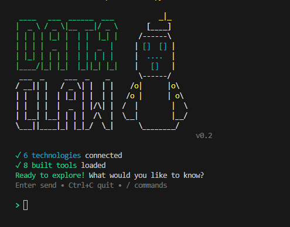

# DataClaw

**An autonomous reasoning agent for data infrastructure.**

Talk to your databases, APIs, message queues, and servers in plain English. DataClaw connects to any technology, figures out how to query it, and learns from every interaction. No boilerplate. No per-technology plugins. Just describe what you want.



---

## What Makes DataClaw Different

Most data tools require you to write queries, learn APIs, or install specific connectors. DataClaw works differently:

- **You describe, it executes** — "show me the top 10 customers by revenue" becomes a SQL query automatically
- **Any technology** — Databases, REST APIs, Kafka, SSH servers, cloud services — one tool for all of them
- **Self-building** — If DataClaw doesn't know how to talk to your system, it writes the code, tests it, and remembers it
- **Learns over time** — Successful operations become reusable skills that make future queries faster and more accurate
- **Security first** — Tiered access control, credential isolation, sandboxed execution for write operations

## How It Works

```
You: "show me the top customers by revenue"

DataClaw:
  1. Detects your database from config
  2. Writes and executes the SQL query
  3. Returns formatted results

You: "list kafka topics"

DataClaw:
  1. Detects Kafka — no built-in tool for this
  2. Auto-generates a connector (kafka-python)
  3. Writes code to list topics
  4. Executes against your live cluster
  5. Returns results
  6. Asks: "Save as reusable skill? [y/N]"
```

The agent has 3 built-in bootstrap tools (`run_query`, `call_api`, `read_files`) that handle databases, APIs, and filesystems instantly. For everything else (Kafka, SSH, cloud services), it generates connectors and code on the fly using your configured LLM.

---

## Install

```bash
pip install dataclaw-bensliman
```

**Optional extras** — install only what you need:

```bash
pip install dataclaw-bensliman[ssh]        # SSH server support (paramiko)
pip install dataclaw-bensliman[kafka]      # Kafka support (kafka-python)
pip install dataclaw-bensliman[mongodb]    # MongoDB support (pymongo)
pip install dataclaw-bensliman[redis]      # Redis support
pip install dataclaw-bensliman[mysql]      # MySQL support
pip install dataclaw-bensliman[snowflake]  # Snowflake support
pip install dataclaw-bensliman[all]        # Everything
```

## Quick Start

### 1. Initialize

```bash
dataclaw init
```

Creates `~/.dataclaw/` with config templates.

### 2. Configure your LLM

Edit `~/.dataclaw/settings.yaml` — uncomment **one** option:

**Local LLM (Ollama):**
```yaml
model:
  orchestrator:
    provider: ollama
    model: llama3.1
    temperature: 0.2
  builder:
    provider: ollama
    model: llama3.1
    temperature: 0.2
```
Requires [Ollama](https://ollama.com) installed (`ollama pull llama3.1`).

**API-based LLM (OpenAI, Anthropic, etc.):**
```yaml
model:
  orchestrator:
    provider: openai               # or: anthropic
    model: gpt-4o-mini             # or: claude-sonnet-4-20250514
    api_key_env: OPENAI_API_KEY    # references .env file
    temperature: 0.2
  builder:
    provider: openai
    model: gpt-4o-mini
    api_key_env: OPENAI_API_KEY
    temperature: 0.2
```
Add your key to `~/.dataclaw/.env`:
```
OPENAI_API_KEY=sk-...
```

### 3. Add your data sources

Edit `~/.dataclaw/connections.yaml`:

```yaml
technologies:

  my_postgres:
    type: database
    driver: psycopg2
    access_level: read
    connection:
      host: localhost
      port: 5432
      database: mydb
      user: ${POSTGRES_USER}
      password: ${POSTGRES_PASSWORD}

  my_api:
    type: api
    driver: requests
    access_level: read
    connection:
      base_url: https://api.example.com
      api_key: ${MY_API_KEY}
```

Credentials go in `~/.dataclaw/.env`:
```
POSTGRES_USER=myuser
POSTGRES_PASSWORD=mypassword
MY_API_KEY=...
```

### 4. Start

```bash
dataclaw
```

---

## Usage

### Natural language

Just describe what you want in plain English:

```
> list all tables in my database
> show the schema of the users table
> how many orders were placed last month?
> what airflow DAGs are running?
> list kafka topics
> show disk usage on the SSH server
> top 5 customers by total spending
```

### Slash commands

Quick actions that bypass the LLM:

| Command                    | Description                          |
|----------------------------|--------------------------------------|
| `/status`                  | System health check                  |
| `/connections`             | Show configured data sources         |
| `/schemas [db]`            | List database schemas                |
| `/tables [db]`             | List all tables                      |
| `/describe <table> [db]`   | Show table columns and types         |
| `/count <table> [db]`      | Count rows in a table                |
| `/sample <table> [db]`     | Show 5 sample rows                   |
| `/tools`                   | List agent-built tools               |
| `/skills`                  | List reusable skills                 |
| `/config`                  | View/edit runtime settings           |
| `/help`                    | Show all commands                    |

### Multi-database

Multiple databases? DataClaw asks which one you mean — or specify directly:

```
> /tables main_db
> /describe raw.orders analytics_db
> /count users my_postgres
```

---

## Supported Technologies

| Type           | Examples                             | Connection Method                |
|----------------|--------------------------------------|----------------------------------|
| **database**   | PostgreSQL, MySQL, SQLite, Snowflake | Built-in `run_query` (SQL)       |
| **api**        | REST APIs, Airflow, any HTTP         | Built-in `call_api` (HTTP)       |
| **filesystem** | Local files, project dirs            | Built-in `read_files`            |
| **messaging**  | Kafka, RabbitMQ                      | Auto-generated connector + code  |
| **server**     | SSH, remote machines                 | Auto-generated connector + code  |
| **cloud**      | AWS, GCP, Azure                      | Auto-generated connector + code  |

**Bootstrap tools** (database, API, filesystem) work instantly with any provider — no setup beyond the connection config.

**Non-bootstrap** technologies (messaging, server, cloud) use LLM-generated connectors. The agent writes the connection code, tests it, and caches it. You only pay the generation cost once.

---

## Skills — How DataClaw Learns

When the agent successfully runs code against a non-bootstrap technology, it offers to save the pattern as a **skill**:

```
> list kafka topics
  ... (success) ...
  Save as reusable skill? [y/N] y
  Skill saved: kafka/list_topics
```

Next time you ask something similar, the agent uses that skill as a reference to generate correct code on the first try:

```
> list kafka consumer groups
  (uses list_topics skill as context → correct code immediately)
```

Skills carry metadata — argument names, defaults, examples, success/failure stats — so the agent gets smarter over time.

---

## Security

| Layer              | Protection                                                    |
|--------------------|---------------------------------------------------------------|
| **Access control** | Tiered: `read` (no writes), `write` (no DDL), `admin` (full) |
| **Credentials**    | Stored in `~/.dataclaw/.env`, never logged or displayed       |
| **Code validation**| AST analysis blocks eval, exec, subprocess, dangerous imports |
| **Sandboxing**     | Write/admin tools execute in Docker with restricted network   |
| **SQL injection**  | Stacked queries blocked, DML/DDL filtered by access level     |

---

## Test Environment

Want to try DataClaw with real data before connecting your own systems?

The [`envi-test/`](./envi-test/) directory contains a Docker Compose setup with:
- **PostgreSQL** (2 instances) with sample warehouse data (customers, orders, products)
- **Airflow** with DAGs for data ingestion and dbt transforms
- **Kafka** (KRaft mode) for message streaming
- **SSH Server** for remote file access

```bash
cd envi-test
docker compose up -d
```

See [`envi-test/README.md`](./envi-test/README.md) for full setup instructions and sample prompts.

---

## Requirements

- Python 3.11+
- An LLM — local via [Ollama](https://ollama.com) or API-based (OpenAI, Anthropic, etc.)
- Docker (optional — needed for sandbox execution and test environment)

